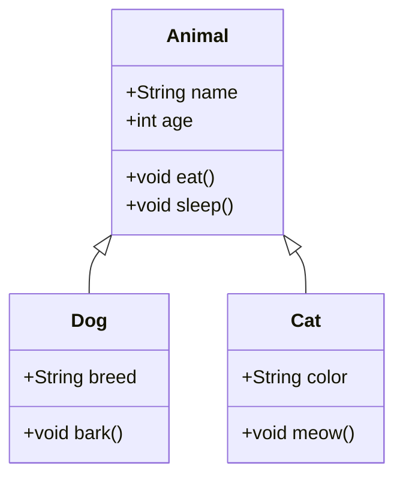
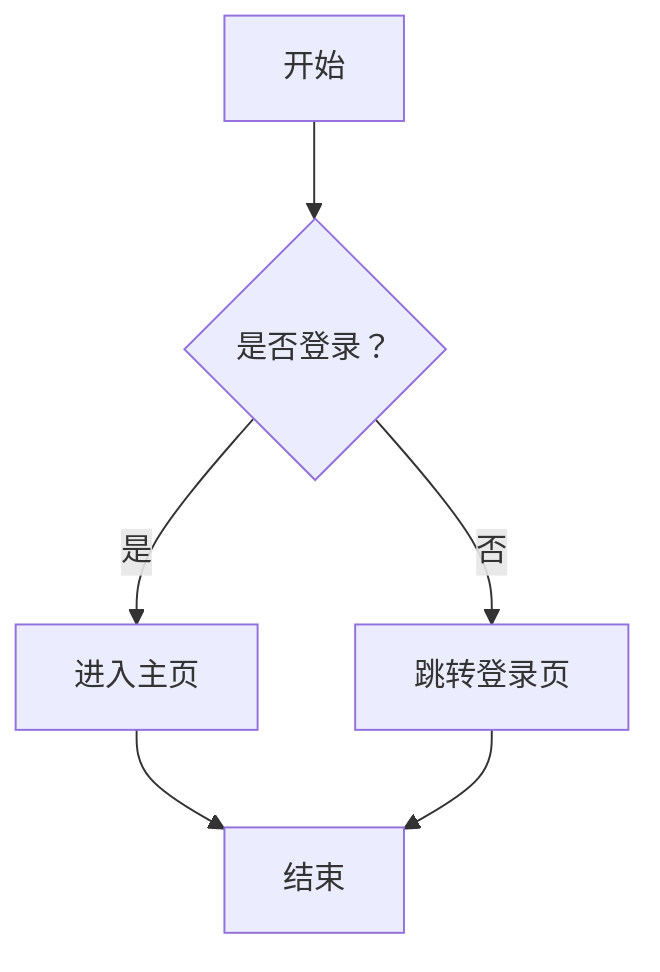

### <center>数据结构课程设计报告 </center>
<center> <h1>题目 </h1> </center>

**班级**：信计241
**学号**：202320944216
**姓名**：黄荣忠

[TOC]

---

**指导书任务和本人完成情况**

|指导书任务（功能）|	完成度|	自评（0-100分）<span style="color: red;">必填</span>|
|--|--|--|
|优先队列：按人气排序的艺人热度榜|	100%	|90|
|哈希表：艺人特长风格快速匹配（摇滚/流行/电子）|	100%|	90|
|双向链表：时间轴上的演出顺序链，支持临时调换|	100%|	90|
|优先队列：处理粉丝预约提醒和冲突检测|	100%	|90|
|场景模拟：防止顶流艺人时间冲突，优化观众流动路径|	100%|	90|
|额外功能1：|…|		|
|额外功能2：|…|	|

---

## 一、设计概要（500-1000字）
问题的应用背景、以及所设计系统面向场景，市面上同类、相近产品（优缺点，表格列出），本设计的主要功能模块，拟采用的数据结构，程序结构、主要算法等，并对设计的难度和可能遇到的问题做估算。
## 二、设计正文

### 1.需求分析

就是解决"做什么"的问题,就是要全面地理解用户的各项要求,并准确地表达所接受的用户需求。一般可采用如下图形工具。
<center>

 

图 1 总体结构</center>
（可用其他工具，如draw.io在线绘制）
<center>

 
图 2 用例图
</center>
（可参考https://blog.csdn.net/qq_42000661/article/details/111805553）

### 2.概要设计
概要设计的主要任务是把需求分析得到的功能结构、用例，转换为软件结构、数据结构和接口。设计软件结构的具体任务是：将一个复杂系统按功能进行模块划分、建立模块的层次结构及调用关系、确定模块间的接口及人机界面等。数据结构设计包括数据特征的描述、确定数据的结构特性、以及数据库的设计。显然，总体设计建立的是目标系统的逻辑模型，与计算机无关。

**核心类图**
<center>


图 3 类图..
</center>

### 3.详细设计

详细设计的主要任务是设计每个模块的实现算法、所需的局部数据结构。
详细设计的目标有两个：实现模块功能的算法要逻辑上正确和算法描述要简明易懂。

**关键流程**

<center>


 </center>

 **关键代码**

``` java
class MusicFestival {
    PriorityQueue <Artist> hotArtists;          // 人气艺人堆
    Map<String, TimeSlot> artistSchedule; // 艺人档期哈希
    DoublyLinkedList<Performance> timeline; // 时间轴链表
    PriorityQueue<FanReminder> reminders; // 粉丝提醒队列
}
```

详细设计的工具：
- （1）图形工具
利用图形工具可以把过程的细节用图形（如类图、对象图、流程图）描述出来。
- （2）表格工具
可以用表格来描述过程的细节，在这张表中列出了各种可能的操作和相应的条件。
- （3）语言工具
用某种高级语言（或者伪码）来描述过程的细节.………（可以写一些关键程序代码，另外截一些界面图并说明实现了什么功能，以证明功能实现了）
### 4.调试分析
编码调试过程遇到的问题，解决方法。
1. 问题1
1. 问题2
1. 问题3
2. ...
### 5.测试结果
每个主要功能至少2组测试数据，分别给出运行结果截图。
- 功能1:.......
  - 功能1.1:....
  - 功能1.2:......
  - ...
- 
### 6.用户使用说明
说明本软件的使用流程，注意事项等。注意要以软件使用者的角度来写。

## 三、设计总结或结论
对设计进行总结和讨论，包括本设计的优、缺点，时、空间复杂度，与其他可能存在的求解方法之间的比较，未实现功能设想等等。

## 参考文献
 (参考以下格式写)
[1] 	权明富，齐佳音，舒华英.客户价值评价指标体系设计[J].南开管理评论，2004，7(3):17-18.
[2] 	刘小洪，邹鹏. 商业银行客户关系价值管理模型研究[J].管理科学，2005，18(3):57-60.
[3] 	刘展，冯宗宪. M.H.DIS模型在我国上市公司信用评估中的应用研究[J].系统工程理论与实践，2004(2):76-82.
[4] 	李纯青，徐寅峰，张洋. 基于知识管理的动态客户关系管理研究[J].中国管理科学，2004，12(2): 88-94.
[5] 	吕延杰，尹涛，王琦. 客户关系管理与主题分析[M].北京，中国邮电出版社，2002. 
[6] 	秦寿康等. 综合评价原理与应用[M].北京：电子工业出版社，2003.
附录（其他必要资料，不需要源代码）

---

## 课程设计成绩评分表
|评价指标	|评价标准	|权重（%）|	得分|
|-|---------|--|--|
|A问题分析与设计|	**优秀**：问题定义清晰，设计思路合理，算法选择恰当，得分区间为90-100分；**良好**：问题定义较清晰，设计思路较合理，算法选择较恰当，得分区间为80-89分；**中等**：问题定义基本清晰，设计思路基本合理，算法选择基本恰当，得分区间为70-79分；**及格**：问题定义模糊，设计思路不合理，算法选择不恰当，得分区间为60-69分；**不及格**：问题定义混乱，设计思路混乱，算法选择错误，得分区间为<60分。|	30	||
|B代码实现	|	**优秀**：程序运行流畅，界面设计友好，功能展示完整，得分区间为90-100分；**良好**：程序运行较流畅，界面设计较友好，功能展示较完整，得分区间为80-89分；**中等**：程序运行基本流畅，界面设计基本友好，功能展示基本完整，得分区间为70-79分；**及格**：程序运行不流畅，界面设计不友好，功能展示不完整，得分区间为60-69分；**不及格**：程序运行混乱，界面设计混乱，功能展示缺失，得分区间为<60分。|	20	||
|E答辩表现	|**优秀**：表达清晰，回答问题准确，对项目理解深刻，得分区间为90-100分；**良好**：表达较清晰，回答问题较准确，对项目理解较深刻，得分区间为80-89分；**中等**：表达基本清晰，回答问题基本准确，对项目理解基本深刻，得分区间为70-79分；**及格**：表达不清晰，回答问题不准确，对项目理解不深刻，得分区间为60-69分；**不及格**：表达混乱，回答问题错误，对项目理解混乱，得分区间为<60分。	|50	||
|	A~E得分加权合计		||||